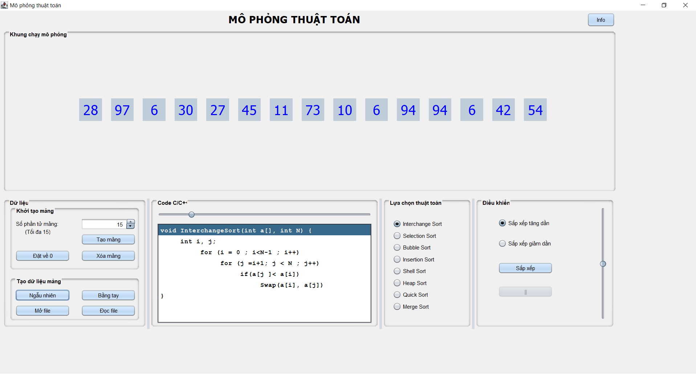

# Nhập môn Java
<a name="top"><a>
## Mục lục

[Thông tin sinh viên](#info)\
[Đề tài](#topic)\
[Mô tả project](#project)\
&nbsp;&nbsp;&nbsp; [Công nghệ sử dụng](#use)\
&nbsp;&nbsp;&nbsp; [Tính năng chính](#main-feature)\
&nbsp;&nbsp;&nbsp; [Danh sách các màn hình](#screen)\
[Demo](#demo)

## Thông tin sinh viên 

Lớp: **SE121.N11.PMCL** 

| STT  | Tên                | MSSV      |
|:-----|:-------------------|:----------|
|  1   |  Phạm Thanh Phong  | 20520272  |

[Lên đầu trang](#top)
## Đề tài 

Xây dựng phần mềm mô phỏng thuật toán

## Mô tả Project 

### Công nghệ sử dụng 

- Ngôn ngữ: Java

[Lên đầu trang](#top)
### Tính năng chính 
- Tạo mảng (ngẫu nhiên, tự tạo, import file).
- Mô phỏng thuật toán chạy bằng C++.
- Mô phỏng 8 thuật toán:Interchange Sort, Selection Sort, Bubble Sort, Insertion Sort, Shell Sort, Heap Sort, Quick Sort, Merge Sort.
- Chỉnh tốc độ nhanh chậm của màn hình mô phỏng.

### Danh sách các màn hình 

  

  
[Lên đầu trang](#top)
